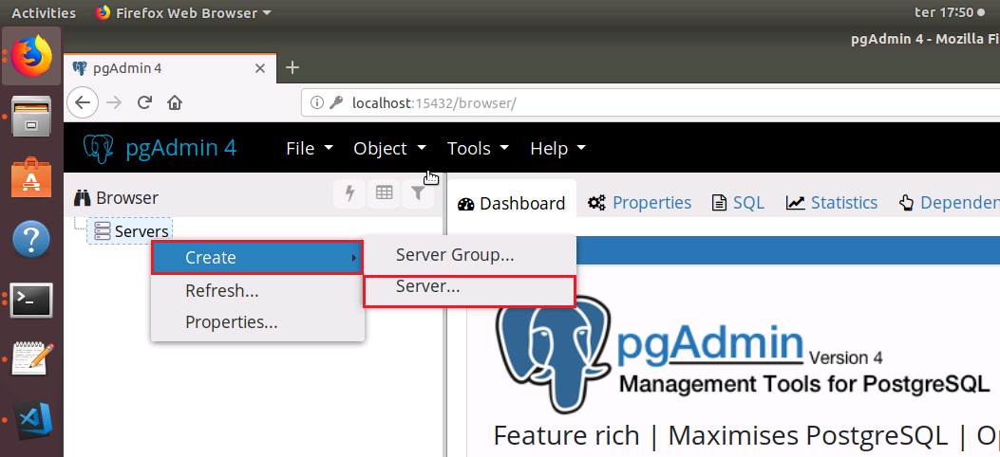
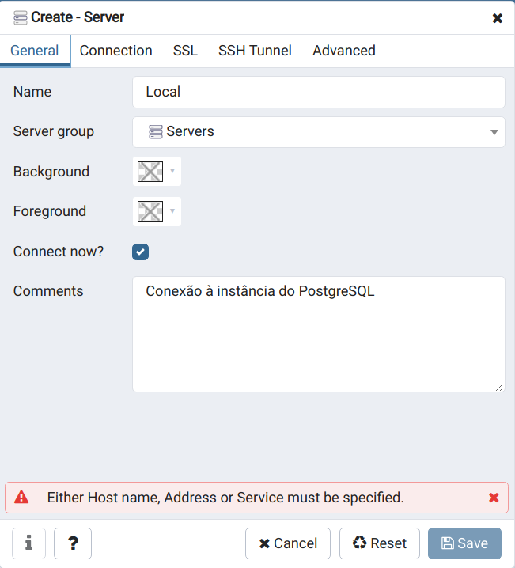
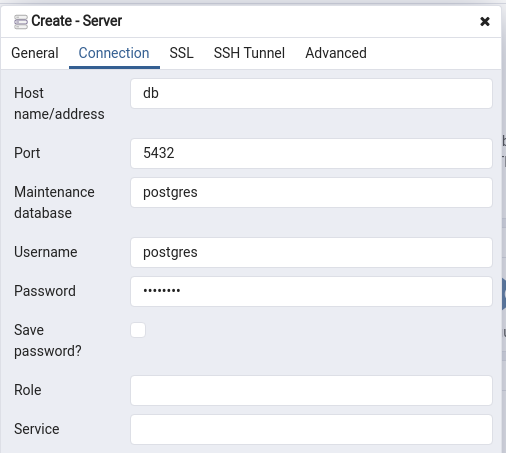

# PostgreSQL & pgAdmin 4 Docker

## Start

- Run: `docker-compose up -d`

- Accessing pgAdmin4: http://localhost:15432
> Use PGADMIN_DEFAULT_EMAIL and PGADMIN_DEFAULT_PASSWORD to login

- Steps to configure pgAdmin4:

